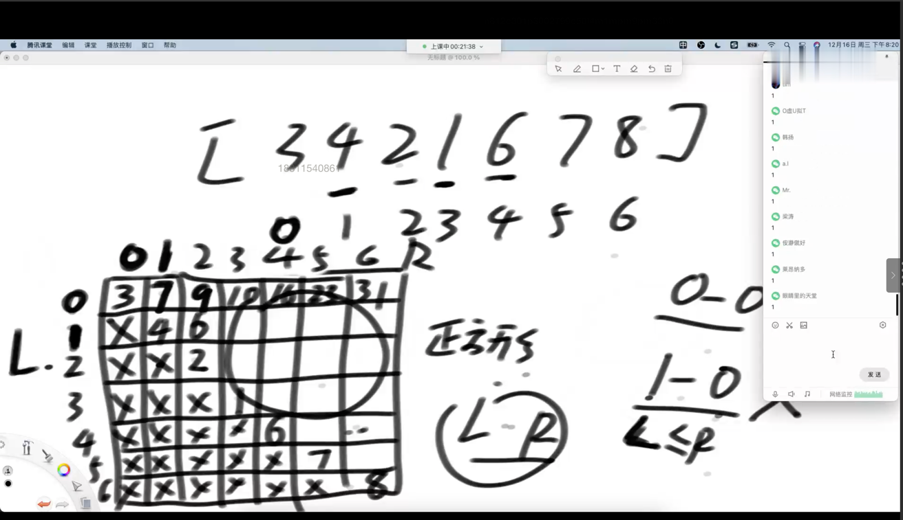

## 题目：求累加和：一个数组[5,4,2,3,5,2,3,5]，sum(arr,l,r);频繁的求一个数组l位置到r位置的和。
两种设计：
    
设计1：图表

设计2： 前缀和数组，一维数组来完成。

    all原始数组：
    help数组：H[i] 代表原始数组0到I的累加和

    sum(3,7)的累加和则是 = H[7] - H[3-1]

    sum(L,R)
    公式：l == 0 则是 H[R]
        L != 0 则：H[R] - H[L-1]