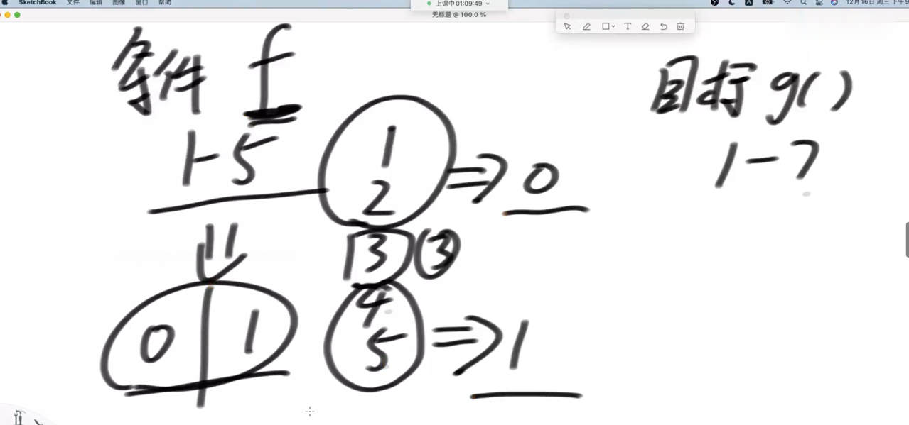

## 介绍随机数

从1~5随机数 到 1~7随机数

从a~b随机数 到 c~d随机数

01不等概率到01等概率随机

问题： 假设f(x) 函数 等概率得到1，2，3，4，5，只能用这个函数。 目标要得到 1，2，3，4，5，6，7 的随机

思考： 条件f(x) 函数
目标：1，2，3，4，5，6，7的随机。

解法一：用f(x) 函数做一个0，1发生器。得到1和2则返回0，得到4和5则返回1，否则重新调用

首先得到0到6的随机，返回值+1就得到了 1到7的随机。

0-6需要3个二进制位。

